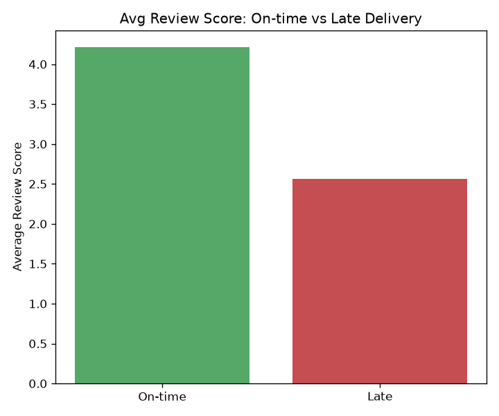
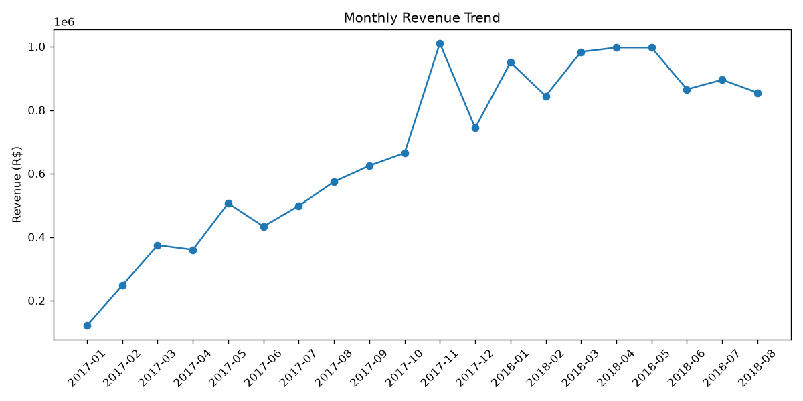
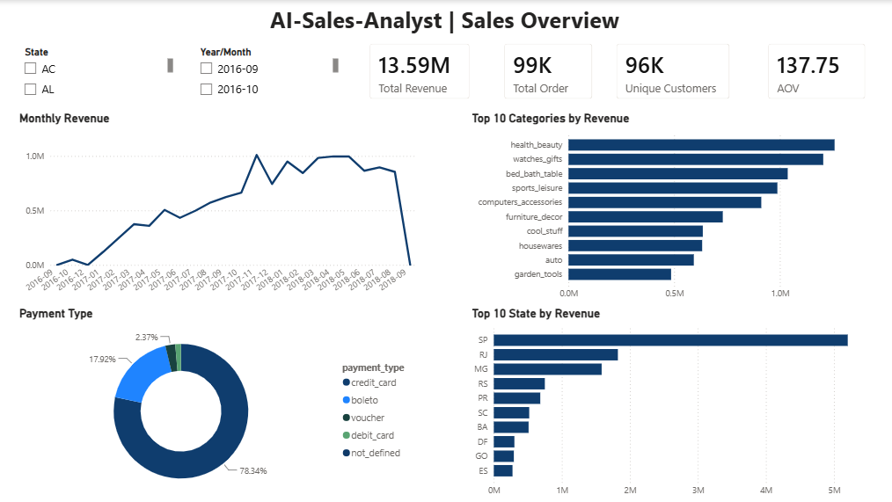
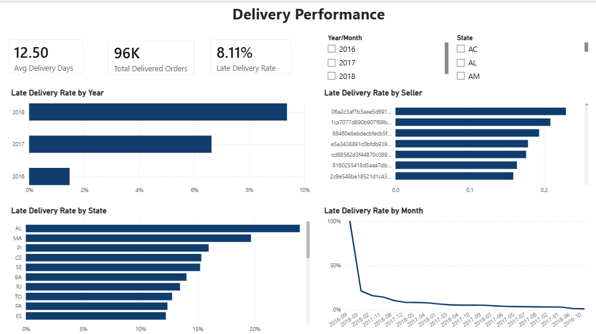
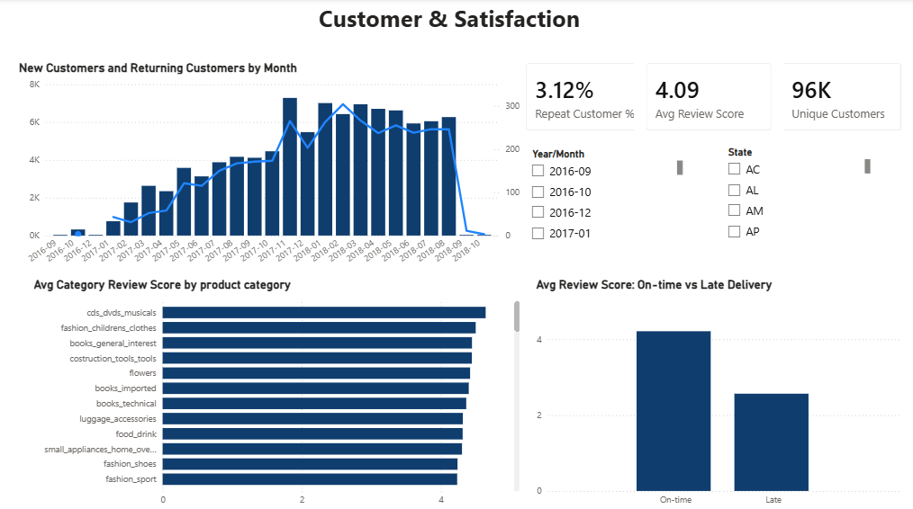

# AI-Sales-Analyst

An end-to-end sales & customer analytics project built on the [Olist Brazilian E-Commerce dataset](https://www.kaggle.com/datasets/olistbr/brazilian-ecommerce) (~100K orders, 2016–2018). The project is being built in four phases — Python analysis and SQL analysis are complete; a Power BI dashboard, an AI integration layer, and a machine learning component are in progress.

## Roadmap

- [x] **Phase 1 — Python (pandas):** Data cleaning, delivery performance analysis, revenue analysis, customer cohort/retention analysis
- [x] **Phase 2 — SQL:** Revenue trends, customer segmentation, seller performance, delivery & payment analysis
- [x] **Phase 3 — Power BI:** Interactive dashboard for sales, delivery, and customer metrics
- [ ] **Phase 4 — AI Integration Layer:** Natural-language querying / AI-assisted insights on top of the analysis
- [ ] **Phase 5 — Machine Learning:** Predictive modeling (e.g. churn, delivery delay, or demand forecasting)

## Dataset

Olist is a Brazilian e-commerce marketplace. The dataset spans 9 relational tables covering orders, order items, payments, reviews, products, sellers, customers, and geolocation, from **Sep 2016 to Oct 2018**, across 27 states.

| Metric | Value |
|---|---|
| Total orders | 98,666 |
| Total product revenue | R$13.59M |
| Average Order Value | R$137.75 |
| Unique customers | 96,096 |
| Repeat customer rate | 3.12% |
| Order cancellation rate | 0.63% |

*(Raw CSVs are not committed to this repo — see [Setup](#setup) to download them.)*

## Project Structure

```
AI-Sales-Analyst/
├── notebooks/
│   ├── 01_data_exploration.ipynb   # Data cleaning, delivery, revenue, customer cohort & review-score analysis
│   ├── chart_revenue_trend.png
│   ├── chart_top_categories.png
│   ├── chart_late_delivery.png
│   └── chart_review_vs_delivery.png
├── sql/
│   └── analysis.sql                # Business-question SQL: revenue, segmentation, retention, delivery
├── dashboard/
│   ├── sales_overview.png
│   ├── delivery_performance.png
│   └── customer_satisfaction.png
├── requirements.txt
└── .gitignore
```

## Analysis Covered

**Python (notebook)**
- Data cleaning & type conversion across orders/order items/products/customers
- Delivery performance: average/median delivery time, late-delivery rate by year
- Revenue analysis: monthly revenue trend, month-over-month change, category & product-level breakdowns
- Customer cohort analysis: new vs. returning customers by month, retention by months-since-first-purchase
- Customer satisfaction: review score analysis, correlated against delivery performance and product category
- Visualizations: revenue trend, top categories, late delivery rate by year, review score vs. delivery status

**SQL**
- Monthly revenue, order volume, and AOV trends (with `LAG()` for MoM growth)
- Customer segmentation: repeat vs. one-time customers, revenue deciles (`NTILE`), top customers by spend
- New vs. returning customer cohorts by month
- Seller performance and late-delivery rate by seller/state
- Payment method mix and category-level AOV
- Order cancellation rate by month

## Key Findings

- **Delivery**: Average delivery time is 12.56 days (median 10.22). The overall late-delivery rate is 8.11%, rising from 6.38% in 2017 to 9.16% in 2018.
- **Revenue**: November 2017 was the peak revenue month (R$1.01M); December 2017 saw a 26.36% drop, driven mainly by fewer orders rather than lower AOV.
- **Top categories by revenue**: health & beauty, watches & gifts, bed/bath/table, sports & leisure, and computer accessories.
- **Payments**: Credit card dominates at 78.3% of payment value, followed by boleto (17.9%).
- **Customer retention**: The customer base is growing but overwhelmingly driven by new customers — the repeat-purchase rate is only ~3%, and retention drops off sharply after the first purchase. This is the project's core business recommendation area: focus on second-purchase incentives and post-purchase engagement.
- **Customer satisfaction**: Delivery reliability is a major driver of satisfaction — orders delivered on time average a 4.21/5 review score, vs. 2.57/5 for late orders (correlation: -0.27).




## Power BI Dashboard

A 3-page interactive dashboard built on the same tables used in the Python and SQL analysis, with DAX measures, synced slicers (month, state), and a consistent theme.

**Sales Overview** — revenue trend, top categories, payment mix, revenue by state


**Delivery Performance** — late delivery rate by year, state, seller, and month


**Customer & Satisfaction** — new vs. returning customers, review score by delivery status, category ratings


*Note: the category review-score chart is filtered to categories with ≥50 orders to avoid small-sample bias; a couple of categories with very few orders (e.g. under 15) can otherwise show misleadingly high averages.*

## Setup

1. Clone the repo:
   ```bash
   git clone https://github.com/anujydv18-oss/AI-Sales-Analyst.git
   cd AI-Sales-Analyst
   ```
2. Download the [Olist dataset from Kaggle](https://www.kaggle.com/datasets/olistbr/brazilian-ecommerce) and place the CSVs in `data/raw/` (this folder is gitignored).
3. Install dependencies:
   ```bash
   pip install -r requirements.txt
   ```
4. Run the notebook:
   ```bash
   jupyter notebook notebooks/01_data_exploration.ipynb
   ```
5. For the SQL analysis, load the CSVs into MySQL and run `sql/analysis.sql`.

## Tools Used

**Current:** Python (pandas, matplotlib, seaborn), Jupyter, SQL (MySQL), Power BI (DAX, Power Query)
**Planned:** Machine Learning (Python), AI integration layer

## Author

Anuj Yadav — [LinkedIn](https://www.linkedin.com/in/anuj-yadav-538192253)